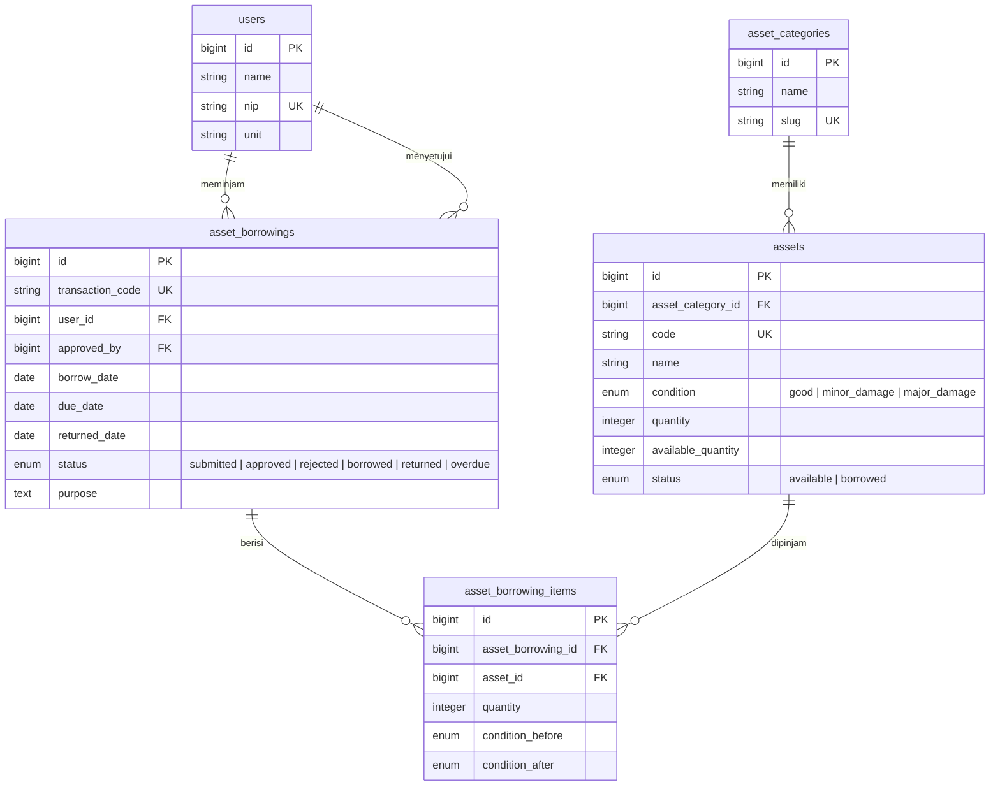
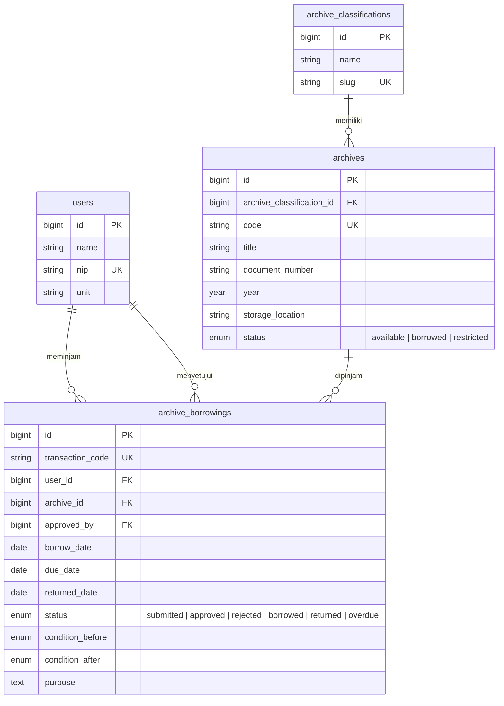
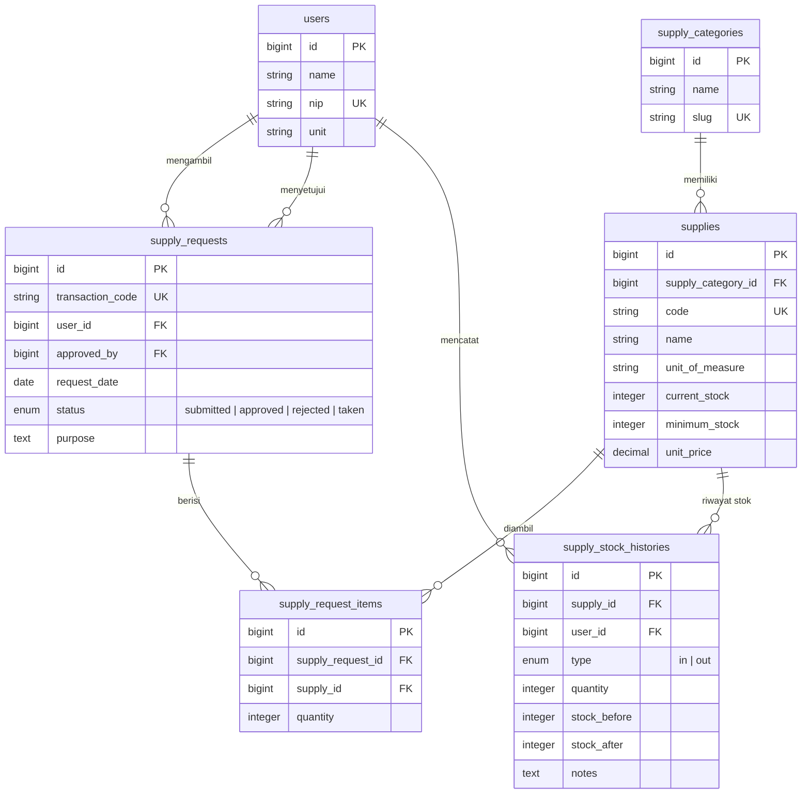

# Entity Relationship Diagram (ERD)
## Sistem Informasi Layanan Peminjaman BMN, Arsip & Pengambilan ATK — BDI Denpasar

> Diagram ini dibuat berdasarkan [migrations.md](file:///c:/laragon/www/diklat-app/migrations.md)

---

## ERD Lengkap

```mermaid
erDiagram
    %% ============================================
    %% MASTER DATA - Users & Roles
    %% ============================================

    users {
        bigint id PK
        string name
        string nip UK "Nomor Induk Pegawai"
        string email UK
        string unit "Unit Kerja"
        string password
        boolean is_active "Default: true"
        timestamp email_verified_at
        timestamp created_at
        timestamp updated_at
        timestamp deleted_at "Soft Delete"
    }

    %% ============================================
    %% MASTER DATA - BMN (Assets)
    %% ============================================

    asset_categories {
        bigint id PK
        string name "Elektronik, Meubelair, dll"
        string slug UK
        text description
        timestamp created_at
        timestamp updated_at
    }

    assets {
        bigint id PK
        bigint asset_category_id FK
        string code UK "Kode BMN"
        string name "Nama Barang"
        string brand "Merk"
        string type "Tipe"
        year year_acquired "Tahun Perolehan"
        enum condition "good | minor_damage | major_damage"
        integer quantity "Jumlah Total"
        integer available_quantity "Jumlah Tersedia"
        string location "Lokasi Penyimpanan"
        enum status "available | borrowed"
        text description
        timestamp created_at
        timestamp updated_at
    }

    %% ============================================
    %% MASTER DATA - Arsip (Archives)
    %% ============================================

    archive_classifications {
        bigint id PK
        string name "Nama Klasifikasi"
        string slug UK
        text description
        timestamp created_at
        timestamp updated_at
    }

    archives {
        bigint id PK
        bigint archive_classification_id FK
        string code UK "Kode Arsip"
        string title "Judul Arsip"
        string document_number "Nomor Dokumen"
        year year "Tahun Arsip"
        string storage_location "Rak / Box"
        enum status "available | borrowed | restricted"
        text description
        timestamp created_at
        timestamp updated_at
    }

    %% ============================================
    %% MASTER DATA - ATK (Supplies)
    %% ============================================

    supply_categories {
        bigint id PK
        string name "Alat Tulis, Kertas, dll"
        string slug UK
        text description
        timestamp created_at
        timestamp updated_at
    }

    supplies {
        bigint id PK
        bigint supply_category_id FK
        string code UK "Kode ATK"
        string name "Nama ATK"
        string unit_of_measure "Pcs, Rim, Pack"
        integer current_stock "Stok Saat Ini"
        integer minimum_stock "Batas Minimum"
        decimal unit_price "Harga Satuan"
        text description
        timestamp created_at
        timestamp updated_at
    }

    supply_stock_histories {
        bigint id PK
        bigint supply_id FK
        bigint user_id FK
        enum type "in | out"
        integer quantity "Jumlah Perubahan"
        integer stock_before "Stok Sebelum"
        integer stock_after "Stok Sesudah"
        text notes
        timestamp created_at
        timestamp updated_at
    }

    %% ============================================
    %% TRANSAKSI - Peminjaman BMN
    %% ============================================

    asset_borrowings {
        bigint id PK
        string transaction_code UK "BMN-YYYYMMDD-XXX"
        bigint user_id FK "Peminjam"
        bigint approved_by FK "Admin Approver"
        date borrow_date "Tanggal Pinjam"
        date due_date "Tanggal Jatuh Tempo"
        date returned_date "Tanggal Kembali Aktual"
        enum status "submitted | approved | rejected | borrowed | returned | overdue"
        text purpose "Keperluan"
        text rejection_reason "Alasan Tolak"
        text return_notes "Catatan Pengembalian"
        timestamp created_at
        timestamp updated_at
    }

    asset_borrowing_items {
        bigint id PK
        bigint asset_borrowing_id FK
        bigint asset_id FK
        integer quantity "Jumlah Dipinjam"
        enum condition_before "good | minor_damage | major_damage"
        enum condition_after "good | minor_damage | major_damage"
        text notes
        timestamp created_at
        timestamp updated_at
    }

    %% ============================================
    %% TRANSAKSI - Peminjaman Arsip
    %% ============================================

    archive_borrowings {
        bigint id PK
        string transaction_code UK "ARS-YYYYMMDD-XXX"
        bigint user_id FK "Peminjam"
        bigint archive_id FK "Arsip Dipinjam"
        bigint approved_by FK "Arsiparis Approver"
        date borrow_date "Tanggal Pinjam"
        date due_date "Tanggal Jatuh Tempo"
        date returned_date "Tanggal Kembali Aktual"
        enum status "submitted | approved | rejected | borrowed | returned | overdue"
        enum condition_before "good | minor_damage | major_damage"
        enum condition_after "good | minor_damage | major_damage"
        text purpose "Keperluan"
        text rejection_reason "Alasan Tolak"
        text return_notes "Catatan Pengembalian"
        timestamp created_at
        timestamp updated_at
    }

    %% ============================================
    %% TRANSAKSI - Pengambilan ATK
    %% ============================================

    supply_requests {
        bigint id PK
        string transaction_code UK "ATK-YYYYMMDD-XXX"
        bigint user_id FK "Pengambil"
        bigint approved_by FK "Admin Approver"
        date request_date "Tanggal Pengambilan"
        enum status "submitted | approved | rejected | taken"
        text purpose "Keperluan"
        text rejection_reason "Alasan Tolak"
        timestamp created_at
        timestamp updated_at
    }

    supply_request_items {
        bigint id PK
        bigint supply_request_id FK
        bigint supply_id FK
        integer quantity "Jumlah Diambil"
        text notes
        timestamp created_at
        timestamp updated_at
    }

    %% ============================================
    %% RELATIONSHIPS
    %% ============================================

    %% Master BMN
    asset_categories ||--o{ assets : "has many"

    %% Master Arsip
    archive_classifications ||--o{ archives : "has many"

    %% Master ATK
    supply_categories ||--o{ supplies : "has many"
    supplies ||--o{ supply_stock_histories : "tracks stock"

    %% Peminjaman BMN
    users ||--o{ asset_borrowings : "borrows (user_id)"
    users ||--o{ asset_borrowings : "approves (approved_by)"
    asset_borrowings ||--o{ asset_borrowing_items : "contains"
    assets ||--o{ asset_borrowing_items : "borrowed as"

    %% Peminjaman Arsip
    users ||--o{ archive_borrowings : "borrows (user_id)"
    users ||--o{ archive_borrowings : "approves (approved_by)"
    archives ||--o{ archive_borrowings : "borrowed as"

    %% Pengambilan ATK
    users ||--o{ supply_requests : "requests (user_id)"
    users ||--o{ supply_requests : "approves (approved_by)"
    supply_requests ||--o{ supply_request_items : "contains"
    supplies ||--o{ supply_request_items : "taken as"

    %% Stok History
    users ||--o{ supply_stock_histories : "performed by"
```

---

## ERD Per Modul

### Modul 1 — Peminjaman BMN

---

### Modul 2 — Peminjaman Arsip

---

### Modul 3 — Pengambilan ATK & Stok

---

## Ringkasan Relasi

| Relasi | Tipe | Keterangan |
|--------|------|------------|
| `asset_categories` → `assets` | One-to-Many | Satu kategori punya banyak BMN |
| `archive_classifications` → `archives` | One-to-Many | Satu klasifikasi punya banyak arsip |
| `supply_categories` → `supplies` | One-to-Many | Satu kategori punya banyak ATK |
| `users` → `asset_borrowings` | One-to-Many | Satu user bisa punya banyak peminjaman BMN |
| `users` → `asset_borrowings` (approved_by) | One-to-Many | Satu admin bisa approve banyak peminjaman |
| `asset_borrowings` → `asset_borrowing_items` | One-to-Many | Satu transaksi berisi banyak item BMN |
| `assets` → `asset_borrowing_items` | One-to-Many | Satu BMN bisa dipinjam di banyak transaksi |
| `users` → `archive_borrowings` | One-to-Many | Satu user bisa punya banyak peminjaman arsip |
| `archives` → `archive_borrowings` | One-to-Many | Satu arsip bisa dipinjam berulang (bergantian) |
| `users` → `supply_requests` | One-to-Many | Satu user bisa punya banyak pengambilan ATK |
| `supply_requests` → `supply_request_items` | One-to-Many | Satu transaksi berisi banyak item ATK |
| `supplies` → `supply_request_items` | One-to-Many | Satu ATK bisa diambil di banyak transaksi |
| `supplies` → `supply_stock_histories` | One-to-Many | Satu ATK punya banyak riwayat perubahan stok |
| `users` → `supply_stock_histories` | One-to-Many | Satu user bisa melakukan banyak perubahan stok |

---
