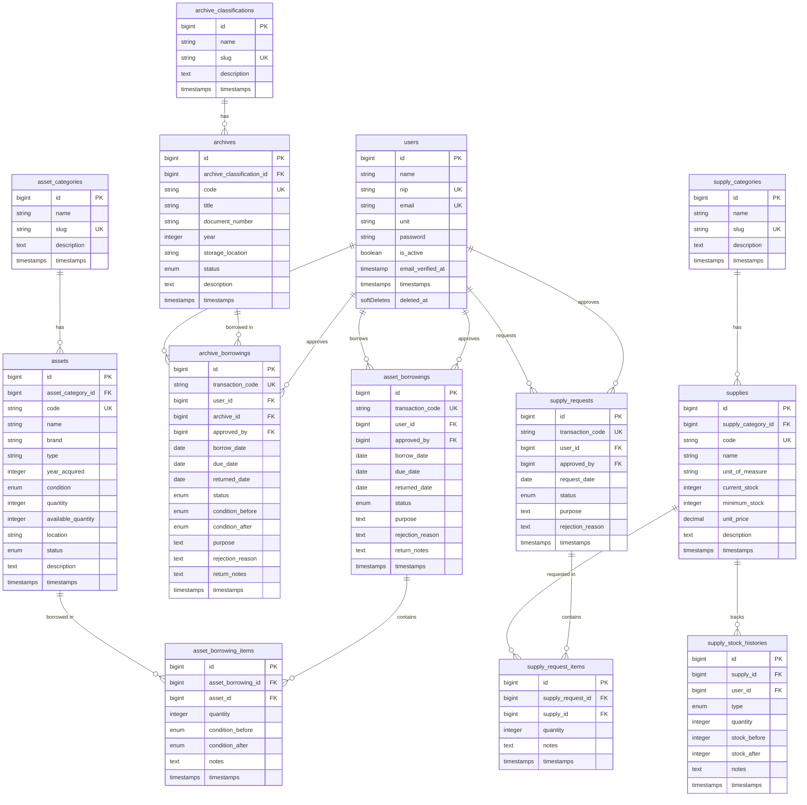

# Database Migrations

Dokumen ini berisi rancangan seluruh migration database untuk **Sistem Informasi Layanan Peminjaman BMN, Arsip & Pengambilan ATK — Balai Diklat Industri Denpasar**, berdasarkan [implementation_plan.md](file:///c:/laragon/www/diklat-app/implementation_plan.md).

> [!NOTE]
> - Semua nama tabel dan kolom menggunakan **bahasa Inggris** sesuai kaidah Laravel.
> - Tabel menggunakan konvensi **snake_case** dan **plural** (Laravel convention).
> - Foreign key menggunakan pola `{singular_table}_id`.
> - Migration yang sudah ada (`users`, `cache`, `jobs`) tidak dibuat ulang, hanya di-modify jika perlu.
> - Role & permission menggunakan package **Spatie Laravel Permission** (tabel otomatis dari package).

---

## Daftar Tabel

| No | Nama Tabel | Keterangan |
|----|------------|------------|
| 1 | `users` | **Modify** — Tambah kolom NIP, unit kerja, status aktif |
| 2 | `asset_categories` | Kategori BMN (Elektronik, Meubelair, dll.) |
| 3 | `assets` | Data master Barang Milik Negara (BMN) |
| 4 | `archive_classifications` | Klasifikasi arsip |
| 5 | `archives` | Data master Arsip |
| 6 | `supply_categories` | Kategori ATK (Alat Tulis, Kertas, dll.) |
| 7 | `supplies` | Data master ATK beserta stok |
| 8 | `supply_stock_histories` | Riwayat perubahan stok ATK (masuk/keluar) |
| 9 | `asset_borrowings` | Transaksi peminjaman BMN |
| 10 | `asset_borrowing_items` | Detail item per transaksi peminjaman BMN |
| 11 | `archive_borrowings` | Transaksi peminjaman Arsip |
| 12 | `supply_requests` | Transaksi pengambilan ATK |
| 13 | `supply_request_items` | Detail item per transaksi pengambilan ATK |
| 14 | `notifications` | Tabel notifikasi bawaan Laravel |

---

## ERD (Entity Relationship Diagram)



---

## Detail Migration

---

### 1. Modify `users` table

> Menambahkan kolom NIP, unit kerja, dan status aktif pada tabel `users` yang sudah ada.

**File:** `database/migrations/xxxx_xx_xx_000001_add_profile_columns_to_users_table.php`

```php
<?php

use Illuminate\Database\Migrations\Migration;
use Illuminate\Database\Schema\Blueprint;
use Illuminate\Support\Facades\Schema;

return new class extends Migration
{
    public function up(): void
    {
        Schema::table('users', function (Blueprint $table) {
            $table->string('nip', 20)->unique()->after('name');
            $table->string('unit')->nullable()->after('nip'); // Unit Kerja
            $table->boolean('is_active')->default(true)->after('password');
            $table->softDeletes();
        });
    }

    public function down(): void
    {
        Schema::table('users', function (Blueprint $table) {
            $table->dropUnique(['nip']);
            $table->dropColumn(['nip', 'unit', 'is_active']);
            $table->dropSoftDeletes();
        });
    }
};
```

**Kolom:**

| Kolom | Tipe | Constraint | Keterangan |
|-------|------|------------|------------|
| `nip` | `string(20)` | `unique` | Nomor Induk Pegawai |
| `unit` | `string` | `nullable` | Unit Kerja pegawai |
| `is_active` | `boolean` | `default(true)` | Status aktif akun |
| `deleted_at` | `timestamp` | `nullable` | Soft delete |

---

### 2. Create `asset_categories` table

> Tabel kategori BMN: Elektronik, Meubelair, Peralatan Kantor, dll.

**File:** `database/migrations/xxxx_xx_xx_000002_create_asset_categories_table.php`

```php
<?php

use Illuminate\Database\Migrations\Migration;
use Illuminate\Database\Schema\Blueprint;
use Illuminate\Support\Facades\Schema;

return new class extends Migration
{
    public function up(): void
    {
        Schema::create('asset_categories', function (Blueprint $table) {
            $table->id();
            $table->string('name');          // Nama kategori: Elektronik, Meubelair, dll.
            $table->string('slug')->unique();
            $table->text('description')->nullable();
            $table->timestamps();
        });
    }

    public function down(): void
    {
        Schema::dropIfExists('asset_categories');
    }
};
```

**Kolom:**

| Kolom | Tipe | Constraint | Keterangan |
|-------|------|------------|------------|
| `id` | `bigint` | `PK, AI` | Primary key |
| `name` | `string` | — | Nama kategori |
| `slug` | `string` | `unique` | Slug URL-friendly |
| `description` | `text` | `nullable` | Deskripsi kategori |
| `created_at` | `timestamp` | `nullable` | — |
| `updated_at` | `timestamp` | `nullable` | — |

---

### 3. Create `assets` table

> Tabel data master Barang Milik Negara (BMN).

**File:** `database/migrations/xxxx_xx_xx_000003_create_assets_table.php`

```php
<?php

use Illuminate\Database\Migrations\Migration;
use Illuminate\Database\Schema\Blueprint;
use Illuminate\Support\Facades\Schema;

return new class extends Migration
{
    public function up(): void
    {
        Schema::create('assets', function (Blueprint $table) {
            $table->id();
            $table->foreignId('asset_category_id')->constrained('asset_categories')->cascadeOnDelete();
            $table->string('code')->unique();           // Kode BMN
            $table->string('name');                      // Nama Barang
            $table->string('brand')->nullable();         // Merk
            $table->string('type')->nullable();          // Tipe
            $table->year('year_acquired')->nullable();   // Tahun Perolehan
            $table->enum('condition', [
                'good',            // Baik
                'minor_damage',    // Rusak Ringan
                'major_damage',    // Rusak Berat
            ])->default('good');
            $table->integer('quantity')->default(1);           // Jumlah total
            $table->integer('available_quantity')->default(1); // Jumlah tersedia
            $table->string('location')->nullable();            // Lokasi penyimpanan
            $table->enum('status', [
                'available',    // Tersedia
                'borrowed',     // Dipinjam (semua stok habis)
            ])->default('available');
            $table->text('description')->nullable();
            $table->timestamps();
        });
    }

    public function down(): void
    {
        Schema::dropIfExists('assets');
    }
};
```

**Kolom:**

| Kolom | Tipe | Constraint | Keterangan |
|-------|------|------------|------------|
| `id` | `bigint` | `PK, AI` | Primary key |
| `asset_category_id` | `bigint` | `FK → asset_categories.id, cascade delete` | Relasi ke kategori |
| `code` | `string` | `unique` | Kode BMN |
| `name` | `string` | — | Nama barang |
| `brand` | `string` | `nullable` | Merk barang |
| `type` | `string` | `nullable` | Tipe barang |
| `year_acquired` | `year` | `nullable` | Tahun perolehan |
| `condition` | `enum` | `default('good')` | good / minor_damage / major_damage |
| `quantity` | `integer` | `default(1)` | Jumlah total |
| `available_quantity` | `integer` | `default(1)` | Jumlah tersedia untuk dipinjam |
| `location` | `string` | `nullable` | Lokasi penyimpanan |
| `status` | `enum` | `default('available')` | available / borrowed |
| `description` | `text` | `nullable` | Deskripsi tambahan |
| `created_at` | `timestamp` | `nullable` | — |
| `updated_at` | `timestamp` | `nullable` | — |

---

### 4. Create `archive_classifications` table

> Tabel klasifikasi arsip.

**File:** `database/migrations/xxxx_xx_xx_000004_create_archive_classifications_table.php`

```php
<?php

use Illuminate\Database\Migrations\Migration;
use Illuminate\Database\Schema\Blueprint;
use Illuminate\Support\Facades\Schema;

return new class extends Migration
{
    public function up(): void
    {
        Schema::create('archive_classifications', function (Blueprint $table) {
            $table->id();
            $table->string('name');          // Nama klasifikasi
            $table->string('slug')->unique();
            $table->text('description')->nullable();
            $table->timestamps();
        });
    }

    public function down(): void
    {
        Schema::dropIfExists('archive_classifications');
    }
};
```

**Kolom:**

| Kolom | Tipe | Constraint | Keterangan |
|-------|------|------------|------------|
| `id` | `bigint` | `PK, AI` | Primary key |
| `name` | `string` | — | Nama klasifikasi |
| `slug` | `string` | `unique` | Slug URL-friendly |
| `description` | `text` | `nullable` | Deskripsi klasifikasi |
| `created_at` | `timestamp` | `nullable` | — |
| `updated_at` | `timestamp` | `nullable` | — |

---

### 5. Create `archives` table

> Tabel data master Arsip.

**File:** `database/migrations/xxxx_xx_xx_000005_create_archives_table.php`

```php
<?php

use Illuminate\Database\Migrations\Migration;
use Illuminate\Database\Schema\Blueprint;
use Illuminate\Support\Facades\Schema;

return new class extends Migration
{
    public function up(): void
    {
        Schema::create('archives', function (Blueprint $table) {
            $table->id();
            $table->foreignId('archive_classification_id')->constrained('archive_classifications')->cascadeOnDelete();
            $table->string('code')->unique();              // Kode Arsip
            $table->string('title');                        // Judul Arsip
            $table->string('document_number')->nullable();  // Nomor Arsip/Dokumen
            $table->year('year')->nullable();               // Tahun arsip
            $table->string('storage_location')->nullable(); // Rak/box penyimpanan
            $table->enum('status', [
                'available',       // Tersedia
                'borrowed',        // Dipinjam
                'restricted',      // Tidak Boleh Dipinjam
            ])->default('available');
            $table->text('description')->nullable();
            $table->timestamps();
        });
    }

    public function down(): void
    {
        Schema::dropIfExists('archives');
    }
};
```

**Kolom:**

| Kolom | Tipe | Constraint | Keterangan |
|-------|------|------------|------------|
| `id` | `bigint` | `PK, AI` | Primary key |
| `archive_classification_id` | `bigint` | `FK → archive_classifications.id, cascade delete` | Relasi ke klasifikasi |
| `code` | `string` | `unique` | Kode arsip |
| `title` | `string` | — | Judul arsip |
| `document_number` | `string` | `nullable` | Nomor dokumen arsip |
| `year` | `year` | `nullable` | Tahun arsip |
| `storage_location` | `string` | `nullable` | Lokasi simpan (rak/box) |
| `status` | `enum` | `default('available')` | available / borrowed / restricted |
| `description` | `text` | `nullable` | Deskripsi tambahan |
| `created_at` | `timestamp` | `nullable` | — |
| `updated_at` | `timestamp` | `nullable` | — |

---

### 6. Create `supply_categories` table

> Tabel kategori ATK: Alat Tulis, Kertas, Tinta, dll.

**File:** `database/migrations/xxxx_xx_xx_000006_create_supply_categories_table.php`

```php
<?php

use Illuminate\Database\Migrations\Migration;
use Illuminate\Database\Schema\Blueprint;
use Illuminate\Support\Facades\Schema;

return new class extends Migration
{
    public function up(): void
    {
        Schema::create('supply_categories', function (Blueprint $table) {
            $table->id();
            $table->string('name');          // Nama kategori ATK
            $table->string('slug')->unique();
            $table->text('description')->nullable();
            $table->timestamps();
        });
    }

    public function down(): void
    {
        Schema::dropIfExists('supply_categories');
    }
};
```

---

### 7. Create `supplies` table

> Tabel data master ATK beserta stok.

**File:** `database/migrations/xxxx_xx_xx_000007_create_supplies_table.php`

```php
<?php

use Illuminate\Database\Migrations\Migration;
use Illuminate\Database\Schema\Blueprint;
use Illuminate\Support\Facades\Schema;

return new class extends Migration
{
    public function up(): void
    {
        Schema::create('supplies', function (Blueprint $table) {
            $table->id();
            $table->foreignId('supply_category_id')->constrained('supply_categories')->cascadeOnDelete();
            $table->string('code')->unique();                   // Kode ATK
            $table->string('name');                              // Nama ATK
            $table->string('unit_of_measure');                   // Satuan: Pcs, Rim, Pack, dll.
            $table->integer('current_stock')->default(0);        // Stok saat ini
            $table->integer('minimum_stock')->default(0);        // Batas minimum stok
            $table->decimal('unit_price', 12, 2)->default(0);    // Harga satuan (opsional)
            $table->text('description')->nullable();
            $table->timestamps();
        });
    }

    public function down(): void
    {
        Schema::dropIfExists('supplies');
    }
};
```

**Kolom:**

| Kolom | Tipe | Constraint | Keterangan |
|-------|------|------------|------------|
| `id` | `bigint` | `PK, AI` | Primary key |
| `supply_category_id` | `bigint` | `FK → supply_categories.id, cascade delete` | Relasi ke kategori ATK |
| `code` | `string` | `unique` | Kode ATK |
| `name` | `string` | — | Nama ATK |
| `unit_of_measure` | `string` | — | Satuan (Pcs, Rim, Pack, dll.) |
| `current_stock` | `integer` | `default(0)` | Jumlah stok saat ini |
| `minimum_stock` | `integer` | `default(0)` | Batas minimum untuk peringatan |
| `unit_price` | `decimal(12,2)` | `default(0)` | Harga per satuan |
| `description` | `text` | `nullable` | Deskripsi tambahan |
| `created_at` | `timestamp` | `nullable` | — |
| `updated_at` | `timestamp` | `nullable` | — |

---

### 8. Create `supply_stock_histories` table

> Riwayat perubahan stok ATK (restocking masuk & pengambilan keluar).

**File:** `database/migrations/xxxx_xx_xx_000008_create_supply_stock_histories_table.php`

```php
<?php

use Illuminate\Database\Migrations\Migration;
use Illuminate\Database\Schema\Blueprint;
use Illuminate\Support\Facades\Schema;

return new class extends Migration
{
    public function up(): void
    {
        Schema::create('supply_stock_histories', function (Blueprint $table) {
            $table->id();
            $table->foreignId('supply_id')->constrained('supplies')->cascadeOnDelete();
            $table->foreignId('user_id')->constrained('users')->cascadeOnDelete(); // Siapa yang melakukan
            $table->enum('type', [
                'in',   // Stok masuk (restocking)
                'out',  // Stok keluar (pengambilan)
            ]);
            $table->integer('quantity');           // Jumlah perubahan
            $table->integer('stock_before');       // Stok sebelum
            $table->integer('stock_after');        // Stok sesudah
            $table->text('notes')->nullable();     // Catatan
            $table->timestamps();
        });
    }

    public function down(): void
    {
        Schema::dropIfExists('supply_stock_histories');
    }
};
```

**Kolom:**

| Kolom | Tipe | Constraint | Keterangan |
|-------|------|------------|------------|
| `id` | `bigint` | `PK, AI` | Primary key |
| `supply_id` | `bigint` | `FK → supplies.id, cascade delete` | Relasi ke ATK |
| `user_id` | `bigint` | `FK → users.id, cascade delete` | User yang melakukan perubahan |
| `type` | `enum` | — | in (masuk) / out (keluar) |
| `quantity` | `integer` | — | Jumlah perubahan stok |
| `stock_before` | `integer` | — | Stok sebelum perubahan |
| `stock_after` | `integer` | — | Stok setelah perubahan |
| `notes` | `text` | `nullable` | Catatan |
| `created_at` | `timestamp` | `nullable` | — |
| `updated_at` | `timestamp` | `nullable` | — |

---

### 9. Create `asset_borrowings` table

> Tabel transaksi peminjaman BMN (header).

**File:** `database/migrations/xxxx_xx_xx_000009_create_asset_borrowings_table.php`

```php
<?php

use Illuminate\Database\Migrations\Migration;
use Illuminate\Database\Schema\Blueprint;
use Illuminate\Support\Facades\Schema;

return new class extends Migration
{
    public function up(): void
    {
        Schema::create('asset_borrowings', function (Blueprint $table) {
            $table->id();
            $table->string('transaction_code')->unique();  // Kode transaksi unik (untuk form print)
            $table->foreignId('user_id')->constrained('users')->cascadeOnDelete();           // Peminjam
            $table->foreignId('approved_by')->nullable()->constrained('users')->nullOnDelete(); // Admin yang approve
            $table->date('borrow_date');                   // Tanggal pinjam
            $table->date('due_date');                      // Tanggal jatuh tempo kembali
            $table->date('returned_date')->nullable();     // Tanggal aktual kembali
            $table->enum('status', [
                'submitted',   // Diajukan
                'approved',    // Disetujui
                'rejected',    // Ditolak
                'borrowed',    // Dipinjam (barang sudah diambil)
                'returned',    // Dikembalikan
                'overdue',     // Terlambat
            ])->default('submitted');
            $table->text('purpose');                        // Keperluan peminjaman
            $table->text('rejection_reason')->nullable();   // Alasan penolakan
            $table->text('return_notes')->nullable();       // Catatan saat pengembalian
            $table->timestamps();
        });
    }

    public function down(): void
    {
        Schema::dropIfExists('asset_borrowings');
    }
};
```

**Kolom:**

| Kolom | Tipe | Constraint | Keterangan |
|-------|------|------------|------------|
| `id` | `bigint` | `PK, AI` | Primary key |
| `transaction_code` | `string` | `unique` | Kode transaksi unik (BMN-20260716-001) |
| `user_id` | `bigint` | `FK → users.id, cascade delete` | Pegawai peminjam |
| `approved_by` | `bigint` | `FK → users.id, null on delete, nullable` | Admin yang menyetujui |
| `borrow_date` | `date` | — | Tanggal pinjam |
| `due_date` | `date` | — | Tanggal jatuh tempo kembali |
| `returned_date` | `date` | `nullable` | Tanggal aktual kembali |
| `status` | `enum` | `default('submitted')` | submitted / approved / rejected / borrowed / returned / overdue |
| `purpose` | `text` | — | Keperluan peminjaman |
| `rejection_reason` | `text` | `nullable` | Alasan penolakan |
| `return_notes` | `text` | `nullable` | Catatan pengembalian |
| `created_at` | `timestamp` | `nullable` | — |
| `updated_at` | `timestamp` | `nullable` | — |

---

### 10. Create `asset_borrowing_items` table

> Detail item barang per transaksi peminjaman BMN.

**File:** `database/migrations/xxxx_xx_xx_000010_create_asset_borrowing_items_table.php`

```php
<?php

use Illuminate\Database\Migrations\Migration;
use Illuminate\Database\Schema\Blueprint;
use Illuminate\Support\Facades\Schema;

return new class extends Migration
{
    public function up(): void
    {
        Schema::create('asset_borrowing_items', function (Blueprint $table) {
            $table->id();
            $table->foreignId('asset_borrowing_id')->constrained('asset_borrowings')->cascadeOnDelete();
            $table->foreignId('asset_id')->constrained('assets')->cascadeOnDelete();
            $table->integer('quantity')->default(1);        // Jumlah dipinjam
            $table->enum('condition_before', [
                'good',
                'minor_damage',
                'major_damage',
            ])->default('good');                            // Kondisi saat dipinjam
            $table->enum('condition_after', [
                'good',
                'minor_damage',
                'major_damage',
            ])->nullable();                                 // Kondisi saat dikembalikan
            $table->text('notes')->nullable();
            $table->timestamps();
        });
    }

    public function down(): void
    {
        Schema::dropIfExists('asset_borrowing_items');
    }
};
```

**Kolom:**

| Kolom | Tipe | Constraint | Keterangan |
|-------|------|------------|------------|
| `id` | `bigint` | `PK, AI` | Primary key |
| `asset_borrowing_id` | `bigint` | `FK → asset_borrowings.id, cascade delete` | Relasi ke header peminjaman |
| `asset_id` | `bigint` | `FK → assets.id, cascade delete` | Relasi ke barang BMN |
| `quantity` | `integer` | `default(1)` | Jumlah dipinjam |
| `condition_before` | `enum` | `default('good')` | Kondisi saat dipinjam |
| `condition_after` | `enum` | `nullable` | Kondisi saat dikembalikan |
| `notes` | `text` | `nullable` | Catatan |
| `created_at` | `timestamp` | `nullable` | — |
| `updated_at` | `timestamp` | `nullable` | — |

---

### 11. Create `archive_borrowings` table

> Tabel transaksi peminjaman Arsip. Karena arsip bersifat unik (1 arsip = 1 dokumen), tidak perlu tabel item terpisah.

**File:** `database/migrations/xxxx_xx_xx_000011_create_archive_borrowings_table.php`

```php
<?php

use Illuminate\Database\Migrations\Migration;
use Illuminate\Database\Schema\Blueprint;
use Illuminate\Support\Facades\Schema;

return new class extends Migration
{
    public function up(): void
    {
        Schema::create('archive_borrowings', function (Blueprint $table) {
            $table->id();
            $table->string('transaction_code')->unique();  // Kode transaksi unik
            $table->foreignId('user_id')->constrained('users')->cascadeOnDelete();           // Peminjam
            $table->foreignId('archive_id')->constrained('archives')->cascadeOnDelete();     // Arsip yang dipinjam
            $table->foreignId('approved_by')->nullable()->constrained('users')->nullOnDelete(); // Arsiparis yang approve
            $table->date('borrow_date');                   // Tanggal pinjam
            $table->date('due_date');                      // Tanggal jatuh tempo kembali
            $table->date('returned_date')->nullable();     // Tanggal aktual kembali
            $table->enum('status', [
                'submitted',   // Diajukan
                'approved',    // Disetujui
                'rejected',    // Ditolak
                'borrowed',    // Dipinjam
                'returned',    // Dikembalikan
                'overdue',     // Terlambat
            ])->default('submitted');
            $table->enum('condition_before', [
                'good',
                'minor_damage',
                'major_damage',
            ])->default('good');                            // Kondisi arsip saat dipinjam
            $table->enum('condition_after', [
                'good',
                'minor_damage',
                'major_damage',
            ])->nullable();                                 // Kondisi arsip saat dikembalikan
            $table->text('purpose');                        // Keperluan peminjaman
            $table->text('rejection_reason')->nullable();   // Alasan penolakan
            $table->text('return_notes')->nullable();       // Catatan pengembalian
            $table->timestamps();
        });
    }

    public function down(): void
    {
        Schema::dropIfExists('archive_borrowings');
    }
};
```

**Kolom:**

| Kolom | Tipe | Constraint | Keterangan |
|-------|------|------------|------------|
| `id` | `bigint` | `PK, AI` | Primary key |
| `transaction_code` | `string` | `unique` | Kode transaksi unik (ARS-20260716-001) |
| `user_id` | `bigint` | `FK → users.id, cascade delete` | Pegawai peminjam |
| `archive_id` | `bigint` | `FK → archives.id, cascade delete` | Arsip yang dipinjam |
| `approved_by` | `bigint` | `FK → users.id, null on delete, nullable` | Arsiparis yang menyetujui |
| `borrow_date` | `date` | — | Tanggal pinjam |
| `due_date` | `date` | — | Tanggal jatuh tempo kembali |
| `returned_date` | `date` | `nullable` | Tanggal aktual kembali |
| `status` | `enum` | `default('submitted')` | submitted / approved / rejected / borrowed / returned / overdue |
| `condition_before` | `enum` | `default('good')` | Kondisi arsip saat dipinjam |
| `condition_after` | `enum` | `nullable` | Kondisi arsip saat dikembalikan |
| `purpose` | `text` | — | Keperluan peminjaman |
| `rejection_reason` | `text` | `nullable` | Alasan penolakan |
| `return_notes` | `text` | `nullable` | Catatan pengembalian |
| `created_at` | `timestamp` | `nullable` | — |
| `updated_at` | `timestamp` | `nullable` | — |

---

### 12. Create `supply_requests` table

> Tabel transaksi pengambilan ATK (header).

**File:** `database/migrations/xxxx_xx_xx_000012_create_supply_requests_table.php`

```php
<?php

use Illuminate\Database\Migrations\Migration;
use Illuminate\Database\Schema\Blueprint;
use Illuminate\Support\Facades\Schema;

return new class extends Migration
{
    public function up(): void
    {
        Schema::create('supply_requests', function (Blueprint $table) {
            $table->id();
            $table->string('transaction_code')->unique();  // Kode transaksi unik
            $table->foreignId('user_id')->constrained('users')->cascadeOnDelete();           // Pengambil
            $table->foreignId('approved_by')->nullable()->constrained('users')->nullOnDelete(); // Admin yang approve
            $table->date('request_date');                   // Tanggal pengambilan
            $table->enum('status', [
                'submitted',   // Diajukan
                'approved',    // Disetujui
                'rejected',    // Ditolak
                'taken',       // Sudah diambil
            ])->default('submitted');
            $table->text('purpose');                        // Keperluan
            $table->text('rejection_reason')->nullable();   // Alasan penolakan
            $table->timestamps();
        });
    }

    public function down(): void
    {
        Schema::dropIfExists('supply_requests');
    }
};
```

**Kolom:**

| Kolom | Tipe | Constraint | Keterangan |
|-------|------|------------|------------|
| `id` | `bigint` | `PK, AI` | Primary key |
| `transaction_code` | `string` | `unique` | Kode transaksi unik (ATK-20260716-001) |
| `user_id` | `bigint` | `FK → users.id, cascade delete` | Pegawai pengambil |
| `approved_by` | `bigint` | `FK → users.id, null on delete, nullable` | Admin yang menyetujui |
| `request_date` | `date` | — | Tanggal pengambilan |
| `status` | `enum` | `default('submitted')` | submitted / approved / rejected / taken |
| `purpose` | `text` | — | Keperluan |
| `rejection_reason` | `text` | `nullable` | Alasan penolakan |
| `created_at` | `timestamp` | `nullable` | — |
| `updated_at` | `timestamp` | `nullable` | — |

---

### 13. Create `supply_request_items` table

> Detail item ATK per transaksi pengambilan.

**File:** `database/migrations/xxxx_xx_xx_000013_create_supply_request_items_table.php`

```php
<?php

use Illuminate\Database\Migrations\Migration;
use Illuminate\Database\Schema\Blueprint;
use Illuminate\Support\Facades\Schema;

return new class extends Migration
{
    public function up(): void
    {
        Schema::create('supply_request_items', function (Blueprint $table) {
            $table->id();
            $table->foreignId('supply_request_id')->constrained('supply_requests')->cascadeOnDelete();
            $table->foreignId('supply_id')->constrained('supplies')->cascadeOnDelete();
            $table->integer('quantity');             // Jumlah diambil
            $table->text('notes')->nullable();
            $table->timestamps();
        });
    }

    public function down(): void
    {
        Schema::dropIfExists('supply_request_items');
    }
};
```

**Kolom:**

| Kolom | Tipe | Constraint | Keterangan |
|-------|------|------------|------------|
| `id` | `bigint` | `PK, AI` | Primary key |
| `supply_request_id` | `bigint` | `FK → supply_requests.id, cascade delete` | Relasi ke header pengambilan |
| `supply_id` | `bigint` | `FK → supplies.id, cascade delete` | Relasi ke item ATK |
| `quantity` | `integer` | — | Jumlah diambil |
| `notes` | `text` | `nullable` | Catatan |
| `created_at` | `timestamp` | `nullable` | — |
| `updated_at` | `timestamp` | `nullable` | — |

---

## Urutan Eksekusi Migration

> [!IMPORTANT]
> Migration harus dijalankan sesuai urutan berikut karena ada dependensi foreign key antar tabel.

```
1.  0001_01_01_000000_create_users_table          (sudah ada)
2.  0001_01_01_000001_create_cache_table           (sudah ada)
3.  0001_01_01_000002_create_jobs_table            (sudah ada)
4.  xxxx_xx_xx_000001_add_profile_columns_to_users_table
5.  xxxx_xx_xx_000002_create_asset_categories_table
6.  xxxx_xx_xx_000003_create_assets_table
7.  xxxx_xx_xx_000004_create_archive_classifications_table
8.  xxxx_xx_xx_000005_create_archives_table
9.  xxxx_xx_xx_000006_create_supply_categories_table
10. xxxx_xx_xx_000007_create_supplies_table
11. xxxx_xx_xx_000008_create_supply_stock_histories_table
12. xxxx_xx_xx_000009_create_asset_borrowings_table
13. xxxx_xx_xx_000010_create_asset_borrowing_items_table
14. xxxx_xx_xx_000011_create_archive_borrowings_table
15. xxxx_xx_xx_000012_create_supply_requests_table
16. xxxx_xx_xx_000013_create_supply_request_items_table
```

> [!NOTE]
> **Tabel Spatie Laravel Permission** (`roles`, `permissions`, `model_has_roles`, `model_has_permissions`, `role_has_permissions`) akan dibuat otomatis saat menjalankan `php artisan vendor:publish --provider="Spatie\Permission\PermissionServiceProvider"` dan `php artisan migrate`.

---

## Mapping Nama (Indonesia → Inggris)

| Istilah Indonesia | Nama Tabel/Kolom (EN) | Keterangan |
|-------------------|-----------------------|------------|
| Barang Milik Negara (BMN) | `assets` | State-owned assets |
| Kategori BMN | `asset_categories` | Asset categories |
| Arsip | `archives` | Archives |
| Klasifikasi Arsip | `archive_classifications` | Archive classifications |
| Alat Tulis Kantor (ATK) | `supplies` | Office supplies |
| Kategori ATK | `supply_categories` | Supply categories |
| Peminjaman BMN | `asset_borrowings` | Asset borrowings |
| Item Peminjaman BMN | `asset_borrowing_items` | Asset borrowing items |
| Peminjaman Arsip | `archive_borrowings` | Archive borrowings |
| Pengambilan ATK | `supply_requests` | Supply requests |
| Item Pengambilan ATK | `supply_request_items` | Supply request items |
| Riwayat Stok ATK | `supply_stock_histories` | Supply stock histories |
| Kode BMN | `code` | Unique asset code |
| Nama Barang | `name` | Item name |
| Merk | `brand` | Brand |
| Tipe | `type` | Type/model |
| Tahun Perolehan | `year_acquired` | Year of acquisition |
| Kondisi | `condition` | Condition |
| Jumlah | `quantity` | Quantity |
| Lokasi | `location` | Location |
| Satuan | `unit_of_measure` | Unit of measure |
| Stok Tersedia | `current_stock` | Current stock |
| Stok Minimum | `minimum_stock` | Minimum stock threshold |
| Harga Satuan | `unit_price` | Unit price |
| Tanggal Pinjam | `borrow_date` | Borrow date |
| Tanggal Jatuh Tempo | `due_date` | Due date |
| Tanggal Kembali | `returned_date` | Return date |
| Keperluan | `purpose` | Purpose |
| Diajukan | `submitted` | Status: submitted |
| Disetujui | `approved` | Status: approved |
| Ditolak | `rejected` | Status: rejected |
| Dipinjam | `borrowed` | Status: borrowed |
| Dikembalikan | `returned` | Status: returned |
| Terlambat | `overdue` | Status: overdue |
| Diambil | `taken` | Status: taken |
| NIP | `nip` | Employee ID number |
| Unit Kerja | `unit` | Work unit/department |

---
